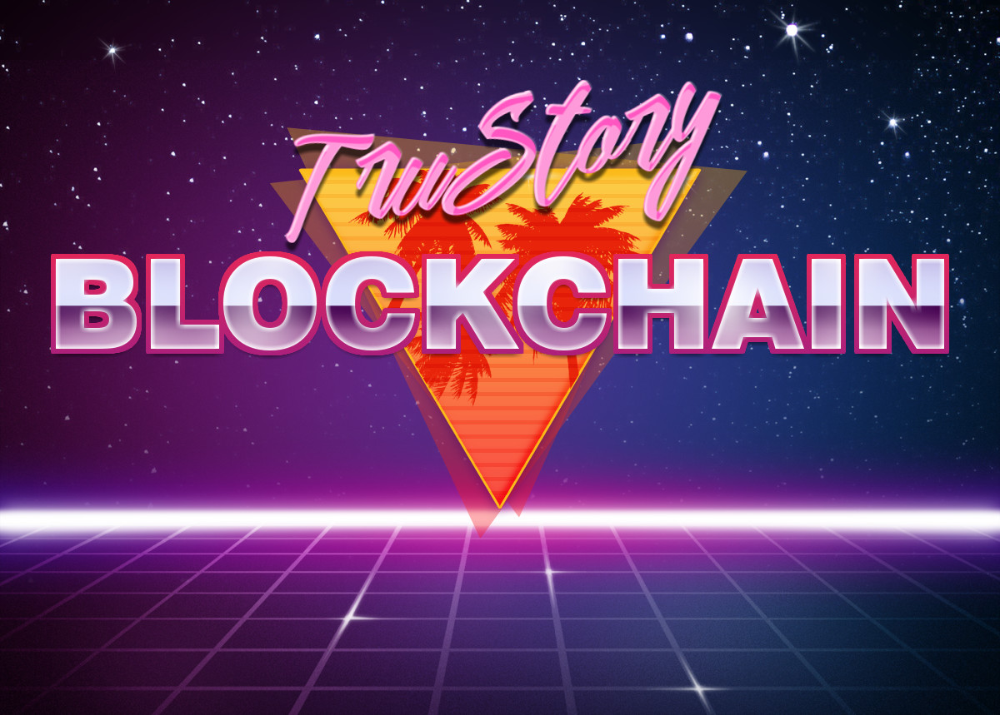

[](https://circleci.com/gh/TruStory/truchain)
[](https://codecov.io/gh/TruStory/truchain)
[](https://goreportcard.com/report/github.com/trustory/truchain)
[](https://github.com/TruStory/truchain)
[](https://godoc.org/github.com/TruStory/truchain/types)

TruChain is the application-specific blockchain that powers [beta.trustory.io](https://beta.trustory.io/).

**🚀🚀🚀 Join the testnet at [https://github.com/TruStory/testnets](https://github.com/TruStory/testnets).**

## Installation

1. Install Go 1.13+ by following the [official docs](https://golang.org/doc/install). 

2. Install truchain binaries:

### Download binaries

Download the latest release from [releases](https://github.com/TruStory/truchain/releases).

### Build from source

```
$ git clone https://github.com/TruStory/truchain.git
$ cd truchain && git checkout master
$ make install
```

This creates:

`truchaind`: TruStory blockchain daemon

`truchaincli`: TruStory blockchain client. Used for creating keys and lightweight interaction with the chain and underlying Tendermint node.

## Getting Started

### Run a single node

```sh
# Build the binaries
$ make build

# Create a wallet and save the mnemonic and passphrase
$ make create-wallet

# Initialize configuration files and genesis file
# Enter passphrase from above
$ make init

# Start the chain
$ make start
```

### Run a local 4-node testnet

A 4-node local testnet can be created with Docker Compose.

NOTE: You will not be able to register accounts because each node won't have a registrar key setup. This restriction will go away after client-side signing.

```sh
# Build daemon for linux so it can run inside a Docker container
$ make build-linux

# Create 4-nodes with their own genesis files and configuration
$ make localnet-start
```

Go to each config file in `build/nodeN/truchaind/config/config.toml` and replace these:

```toml
laddr = "tcp://0.0.0.0:26657"
addr_book_strict = false
```

```sh
# stop and restart
$ make localnet-stop && make localnet-start

# Tail logs
$ docker-compose logs -f
```

## Testing

```sh
# Run linter
$ make check

# Run tests
$ make test
```
